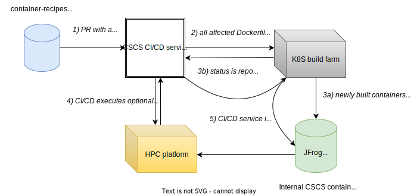

# Collection of HPC container Docker recipes

This repository provides a common framework to build, test and deploy Docker container images at CSCS. The repository is organised as a collection of folders where each folder contains one or more of the Dockerfiles describing the build process of the containerized application and optional files needed for testing.

# How it works?



This repository is registered at CSCS CI/CD service and is using build farm infrastructure to run pipelines for any of the applications. For each pipeline three stages are defined:
```yml
stages:
  - build
  - run
  - deploy
```
and each stage can define multiple jobs that GitLab runner will execute. Please have a look at [CI/CD template file](ci/common.yml) for the definition of basic templates for each of the stages.

| :exclamation:  Important: build farm runs on AMD zen2 architecture |
|---------------------------------------------------------|


# How to add new Dockerfile recipe to the collection?
New recipes are added via a pull request to the `main` branch. Each PR must contain:
 - one or more of the Dockerfiles
 - `ci.yml` - script that defines the CI/CD pipeline
 - `README.md` - short description of the application and Dockerfile(s)

The PR will be reviewed and a new pipeline will be added to the project. Minimalistic `ci.yml` should contain the following:
```yml
include:
  - local: '/ci/common.yml'

build my image:
  extends: .build-image
  variables:
    DOCKERFILE: myapp/Dockerfile
    DOCKER_BUILD_ARGS: '["VAR=value"]'

deploy my image:
  extends: .deploy-image-jfrog
  needs: ["build my image"]
  variables:
    APP: 'myappname'
    ARCH: 'a100'
    VERSION_TAG: '1.0'
```

with the the following directory structure for `myapp`: 
```
container-recipes/
| ci/
| myapp/
| | Dockerfile
| | ci.yml
| | README.md
```

## Comments
The example pipeline above uses two stages - `build my image` and `deploy my image`. You can avoid deployment stage, but then your container will be stored in a temporary location in CSCS container registry and cleaned up after a few weeks. More information about variables used in each stage is available in the [next section](#writing-your-ciyml-file). 


 <!-- - (optinal) list of arguments passed to `docker build` command via `--build-arg` argument. 

`Deploy` stage requires three argments:
* `APP` - name of the application
* `ARCH` - architecture for which container was built
* `VERSION_TAG` - version of the application -->

If the build stage is successful, the final image is pushed to  `$CSCS_REGISTRY/contbuild/apps/public/$ARCH/$APP:$VERSION_TAG`. At the moment `CSCS_REGISTRY` variable points to https://jfrog.svc.cscs.ch/artifactory.

Run `sarus pull https://jfrog.svc.cscs.ch/artifactory/contbuild/apps/public/a100/myappname:1.0` from the compute or login node to pull the example image to your local working directory.

# Writing your ci.yml file
We use GitLab runner to defined and execute the logic of the pipelines. The full documentation for GitLab ci.yml keywords is available [here](https://docs.gitlab.com/ee/ci/yaml/). Our [CI/CD template file](ci/common.yml) defines the following templates to build, test and deploy images.

### .build-image
* Template for building images.
* Stage: build
* Arguments:
  - DOCKERFILE - name of the Dockerfile
  - DOCKER_BUILD_ARGS - (optional) list of the docker build arguments passed to `docker build` command via `--build-arg` argument


### .run-reframe-test
* Template for running ReFrame tests.
* Stage: run
* Arguments:
  - REFRAME_COMMAND - full ReFrame command to run a test of containerized application. ReFrame command will be executed from the root folder of the repository (from `./container-recipes`).

Use `-S my_image_name_var="$BASE_IMAGE"` argment of ReFrame to set `my_image_name_var` variable of the test to point to the container URL. Inside Python test the following line will be relevant
```Python
my_image_name_var = variable(str, value='NULL')
```

| :warning:  Waring: this part of documentation is subjected to change|
|---------------------------------------------------------------------|

### .run-test-hohgant-cpu
* Template for running Slurm CPU jobs on a TDS cluster  
* Stage: run
* Arguments:
  - aa
  - bb


<!-- 
* `.run-test-hohgant-cpu:` - template for running Slurm tests on Hohgant cpu partition
* `.run-test-hohgant-a100:` - template for running Slurm tests on Hohgan nvidia GPU partition
* `.deploy-image-jfrog:` - template for deploying images at persistent location in JFrog artifactory -->


# Enabling tests

<!-- Let's start with this simple example for `ci.yml`:
```yml
# This is a mandatory statement which enables the definition of common templates.
include:
  - local: '/ci/common.yml'

# Define the name of the job that will be displayed 
build app image:
  extends: .build-image
  variables:
    CSCS_REBUILD_POLICY: always
    DOCKERFILE: SIRIUS/gcc-mkl/Dockerfile
    NAME_TAG: 'sirius-develop'
    DOCKER_BUILD_ARGS: '["CUDA_ARCH=80"]'
```
 -->

